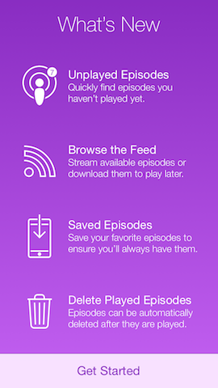
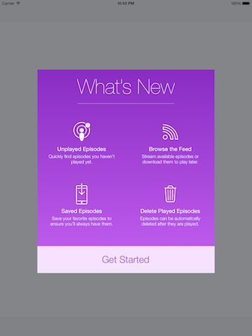
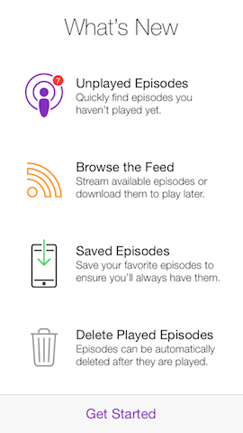
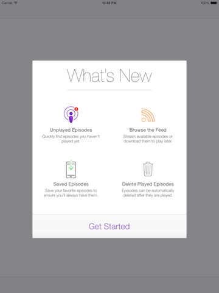

# What's New

Easily present the latest changes and features to your users on app updates.

----

## What is it?

Since iOS 7, apps update automatically. This is great for getting more users running the latest version of your app. However, it essentially eliminated the one place where developers left notes on the updates. Apple has alleviated this issue in their own apps by presenting major changes on app launch.

**A note to you:**
Only major changes should be displayed, otherwise they're just getting in the way of the user using the app. Please use this pattern conservatively.

**What's it do?** 
With `MTZWhatsNew` and `MTZWhatsNewViewController`, you can easily do the same. On app launch, any changes made to the app since the previous launch can be displayed to the user.

**How do I do?**
Simply provide a list of changes (and optionally artwork) associated with each version of the app and that's it. You'll be asked to present them to ths user and you can do so however you'd like.

**What's new for you.**
All changes made since the user last opened the app can be displayed, even if those changes span multiple versions.


## Just Look At It.

 


## Display It.

It's simple to get the changes and display them. In `application:didFinishLaunchingWithOptions:` add:

```objc
[MTZWhatsNew handleWhatsNew:^(NSDictionary *whatsNew) {
	MTZWhatsNewViewController *vc = [[MTZWhatsNewViewController alloc] initWithFeatures:whatsNew];
	[self.window.rootViewController presentViewController:vc animated:NO completion:nil];
}];
```


## Customize It.

It's easy to customize. In just a few lines, you can display it like this:

 

On app launch, ```MTZWhatsNew``` provides you with the changes needed to be displayed, if any. You can do whatever you'd like with this. However, included is a cusomizable view controller to display what's new. The background colors (a gradient), the style (light or dark content), and the button title are all configurable. By default, everything looks and works great on all iOS 7 devices.
