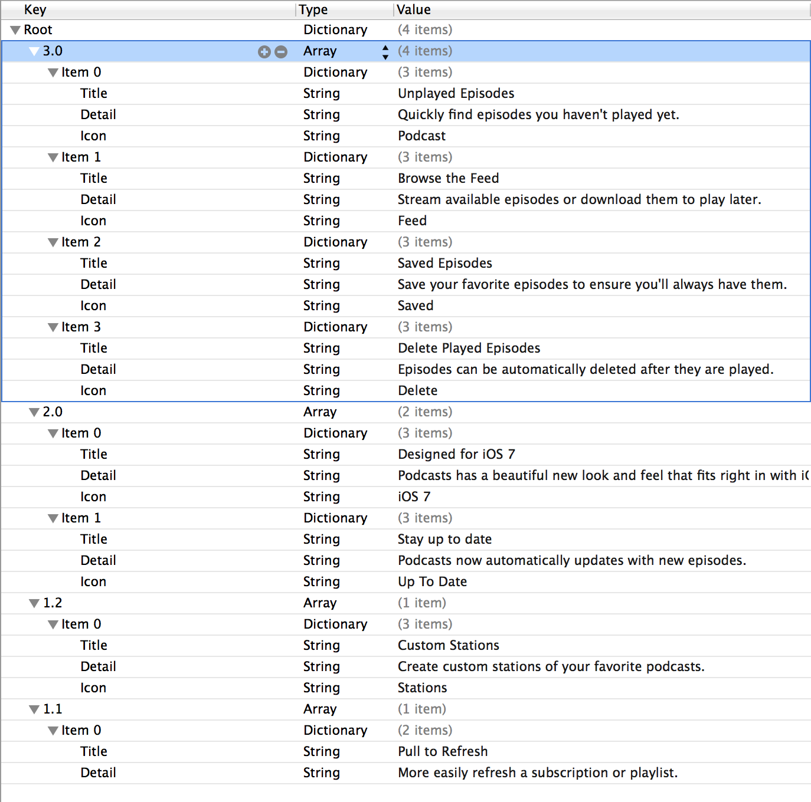
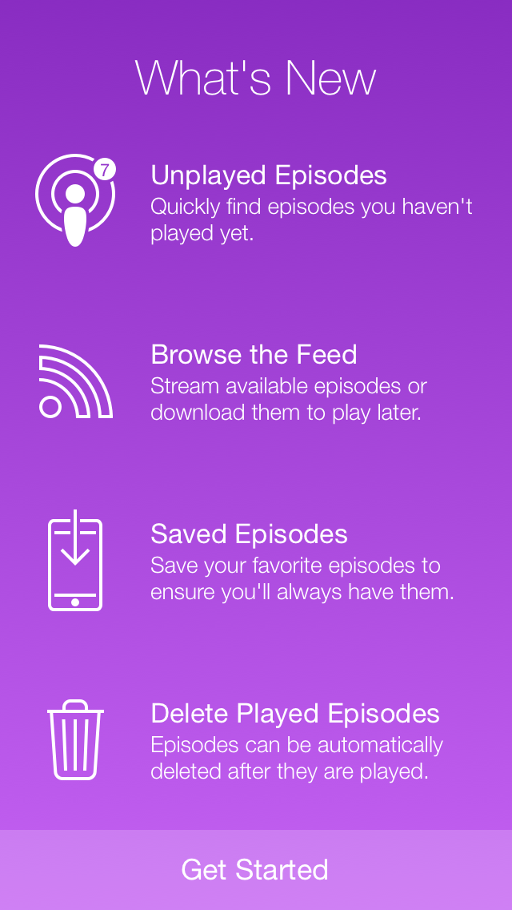

# What's New

Making it easy to create a "What's New" view controller on app updates.

Simply create a propery list like this:

into a beautiful modal view controller this:

The What's New view controller will automatically present itself on app launch of a new version of the app and show all updates since the app version the user last opened.